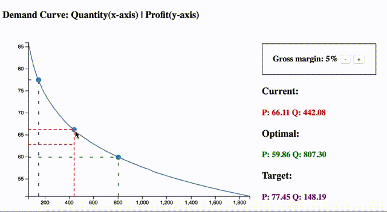

# Team 6 - DS Watson

The client front-end code is mainly packaged in "hackathon.html". We developed this front-end after 2 data scientists and a business user investigated the dataset, explored the interest patterns, and trainned up a model. 

The local server demo source codes are packaged inside the "server-demo" folder

Screenshot:

